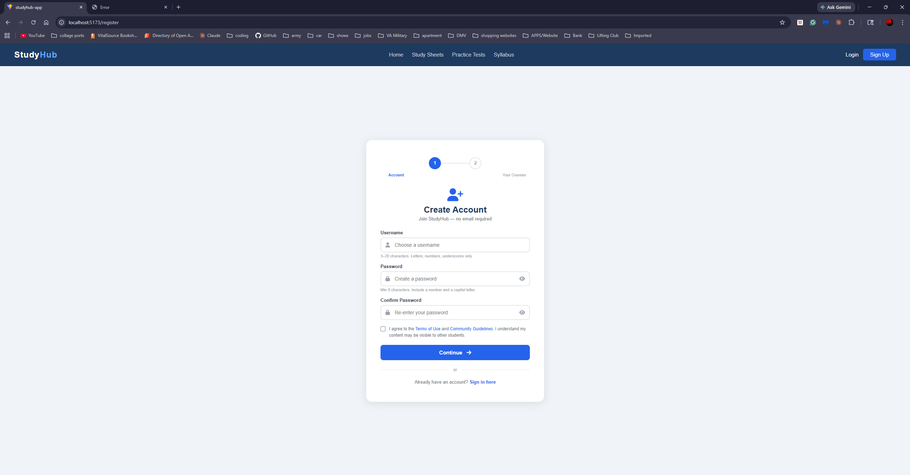
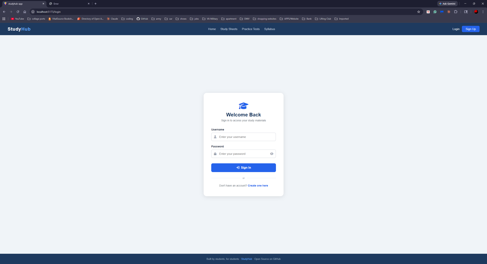

# StudyHub

StudyHub is a student-focused web app where users can register, log in, and collaborate around course study materials.

## Project Overview
- Frontend built with React and Vite
- Backend API built with Node.js and Express
- PostgreSQL database managed through Prisma
- JWT-based authentication for user sessions

## Main User Flow
1. Create an account
2. Log in
3. Access the dashboard and study features

## Screenshots

### Home Page


### Login Page


### Register Page


## Local Development
1. Install dependencies:

```bash
npm --prefix backend install
npm --prefix frontend/studyhub-app install
```

2. Create a local backend `.env` with your own values for:
- `PORT`
- `JWT_SECRET`
- `DATABASE_URL`

3. Run database migrations:

```bash
cd backend
npx prisma migrate dev --name init
```

4. Start the backend:

```bash
npm --prefix backend run dev
```

5. Start the frontend:

```bash
npm --prefix frontend/studyhub-app run dev
```

## Notes
- Keep secrets only in local `.env` files.
- Do not commit credentials, API keys, or private connection strings.